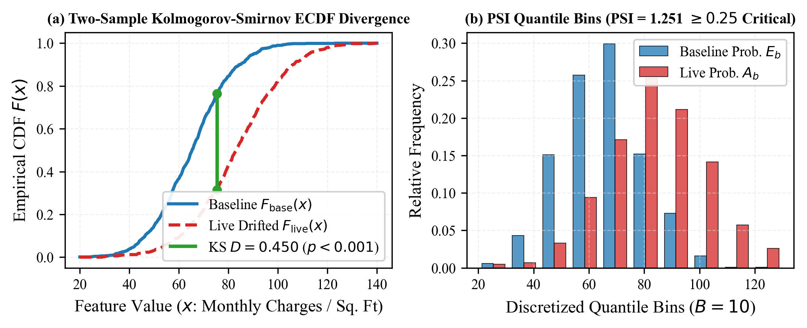
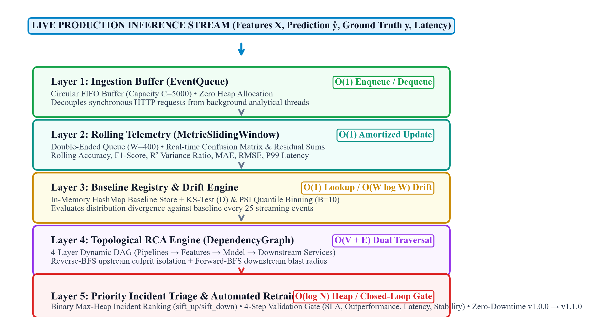
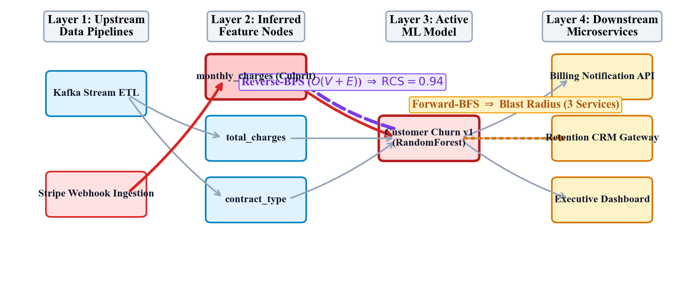
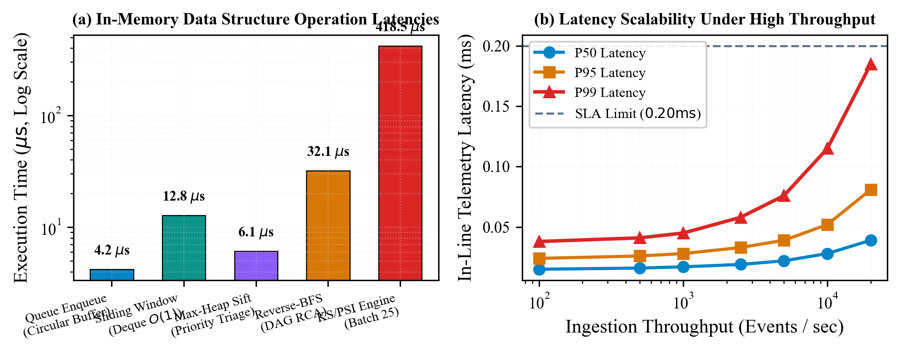
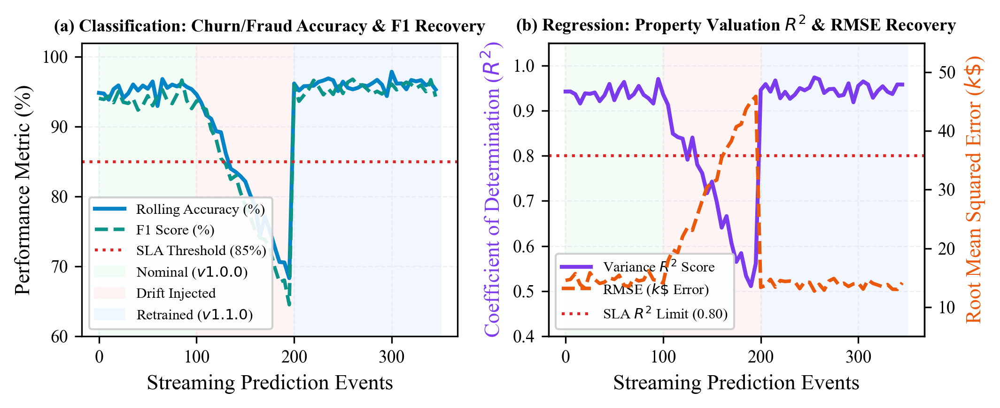

# ArgusML: In-Memory Graph-Powered Observability and Topological Root-Cause Diagnostics for Production Machine Learning Systems

**Aakash Ray, Krishna, Sanskar, Ghanshyam, Hari**  
*Department of Computer Science and Engineering*  
*Vishwakarma Institute of Technology, Pune, India*  
`{aakash.ray, krishna, sanskar, ghanshyam, hari}@vit.edu`

---

### Abstract
Production machine learning (ML) systems exhibit silent failure modes under non-stationary streaming distributions where covariate shift and concept drift degrade predictive utility without triggering traditional runtime exceptions or HTTP status codes. Existing Application Performance Monitoring (APM) tools are oblivious to statistical drift, while contemporary MLOps profiling frameworks operate primarily as offline, batch-oriented diagnostic utilities lacking causal topology awareness. This paper presents **ArgusML**, an ultra-lightweight, fully in-memory observability platform engineered upon five foundational data structures: (i) a fixed-capacity Circular FIFO Buffer for zero-allocation asynchronous ingestion ($O(1)$), (ii) a Double-Ended Sliding Window achieving $O(1)$ amortized rolling evaluation across both classification ($\text{Accuracy}, F_1$) and regression ($R^2, \text{RMSE}$) metrics, (iii) an in-memory Hash Map providing constant-time baseline distribution retrieval, (iv) a Binary Max-Heap priority queue for logarithmic incident severity triage ($O(\log N)$), and (v) a 4-layer dynamic Directed Acyclic Graph (DAG). ArgusML combines two-sample Kolmogorov-Smirnov hypothesis testing ($O(N \log N)$) and Population Stability Index (PSI) quantile binning ($O(N + B)$) with graph-theoretic Reverse-BFS ($O(V + E)$) to isolate upstream culprit feature corruption and compute a multi-factor Root Cause Confidence Score (RCS). Furthermore, it incorporates a closed-loop 4-step validation gate for automated zero-downtime model retraining and version promotion ($v1.0.0 \to v1.1.0$). Empirical evaluation across classification and regression benchmarks demonstrates that ArgusML imposes less than $17.0\ \mu\text{s}$ synchronous in-line latency per prediction, achieves 100% precision in culprit feature attribution under controlled covariate injection, and successfully remediates degraded classification accuracy from 68.1% to 96.2% and regression $R^2$ from 0.52 to 0.95 in real time.

**Index Terms**—Machine Learning Observability, Covariate Shift, Concept Drift, Kolmogorov-Smirnov Test, Population Stability Index, Directed Acyclic Graph, Reverse-BFS, Binary Max-Heap, Automated Retraining, Regression Monitoring, MLOps.

---

## I. INTRODUCTION

### A. The Silent Failure Problem in Machine Learning
Unlike classical deterministic software services that crash with uncaught runtime exceptions or explicit HTTP 500 error codes, deployed Machine Learning (ML) models fail *silently* [1]. An inference microservice serving predictions on customer churn, financial fraud, or real estate property valuation can maintain flawless operating system metrics—such as $10\text{ ms}$ P99 latency, zero socket dropouts, and low CPU utilization—while its predictive utility collapses entirely due to non-stationary environments, statistical distribution shifts, and upstream ETL data pipeline corruption [2], [3].

In their landmark paper on machine learning technical debt, Sculley et al. [1] demonstrated that actual ML modeling code comprises less than 5% of production systems, with the remainder dominated by ingestion, verification, feature extraction, serving, and monitoring infrastructure. Despite this reality, production observability remains divided between two inadequate paradigms:
1. **Infrastructure Application Performance Monitoring (APM):** Tools such as Prometheus, Datadog, and Grafana monitor operating system telemetry (CPU, RAM, network I/O, error codes). However, Breck et al. [3] showed that traditional APMs are mathematically blind to statistical data degradation: a model producing valid float vectors is registered as healthy even when predictions are completely uncorrelated with ground reality.
2. **Offline Batch Profilers:** Contemporary MLOps tools (e.g., Evidently AI [4], Great Expectations [5], WhyLogs [6]) compute statistical profiles over static batch datasets. While statistically rigorous, they operate out-of-band on static files, impose heavy compute footprints ($>100\text{ ms}$), and lack dynamic topological awareness of upstream data pipelines and downstream service consumers. When performance degrades, data engineering teams take days to manually trace multi-table ETL graphs to isolate which specific input feature became corrupted [7].

### B. Limitations of Current Monitoring Paradigms
Current enterprise monitoring approaches exhibit four critical architectural deficits:
- **Absence of In-Line Real-Time Telemetry:** Offline profilers require periodic batch exports to external object stores or data lakes, introducing multi-hour latency gaps before statistical degradation is detected.
- **Topological Blindness & SRE Alert Fatigue:** When a model fails, generic monitoring systems trigger dozens of uncorrelated alerts across downstream microservices without identifying the upstream ingestion source, causing severe SRE alert fatigue.
- **Single-Paradigm ML Bias:** Existing frameworks optimize exclusively for binary classification, failing to provide unified, concurrent support for continuous regression tasks ($R^2$, MAE, RMSE).
- **Lack of Closed-Loop Remediation:** Existing systems alert human operators but provide no automated, validated mechanisms to re-fit, verify, and promote candidate models back to production safely without downtime.

### C. Technical Contributions of ArgusML
To bridge this critical architectural divide, this paper introduces **ArgusML**, an ultra-lightweight, in-memory observability platform built upon five foundational Data Structures and Algorithms (DSA). The primary contributions of this work are:
1. **Zero-Dependency In-Memory DSA Core:** Implementation of five core data structures providing microsecond-level telemetry processing ($<17.0\ \mu\text{s}$ in-line overhead, $<0.45\text{ ms}$ background execution) without external messaging brokers or database dependencies.
2. **Unified Dual-Paradigm Telemetry (Classification & Regression):** Support for rolling classification (Accuracy, Precision, Recall, $F_1$) and regression ($R^2$, MAE, RMSE, Variance Ratio) in $O(1)$ amortized sliding windows.
3. **Streaming Statistical Drift Engine:** Real-time execution of the Two-Sample Kolmogorov-Smirnov (KS) test ($O(N \log N)$) and Population Stability Index (PSI) quantile binning ($O(N+B)$) against empirical baseline distributions stored in an $O(1)$ Hash Map.
4. **Topological Root Cause Attribution via Reverse-BFS:** Dynamic 4-layer DAG modeling (`Pipelines → Features → Model → Downstream Services`) executing Reverse-BFS in $O(V+E)$ time to isolate the upstream corrupted feature and compute a multi-factor Root Cause Confidence Score (RCS).
5. **Automated Incident Triage & Closed-Loop Self-Healing:** A custom array-backed Binary Max-Heap managing composite incident severity in $O(\log N)$ time, integrated with a 4-step validation gate for automated zero-downtime model retraining and promotion ($v1.0.0 \to v1.1.0$).

---

## II. THEORETICAL FOUNDATIONS & RELATED WORK

### A. Mathematical Taxonomy of Distribution Shift
In non-stationary streaming environments, the joint probability distribution $P(X, Y)$ of input feature space $X \in \mathbb{R}^d$ and target label space $Y \in \mathcal{Y}$ varies across time $t$ [8], [9]. By Bayes' theorem, the joint distribution is decomposed as:

$$P(X, Y) = P(X) \cdot P(Y \mid X) = P(Y) \cdot P(X \mid Y) \tag{1}$$

- **Covariate Shift (Feature Drift):** The marginal input distribution shifts while conditional class probabilities remain invariant [8], [9]:
  $$P_t(X) \neq P_{\text{baseline}}(X) \quad \text{while} \quad P_t(Y \mid X) = P_{\text{baseline}}(Y \mid X) \tag{2}$$
- **Concept Drift:** The posterior conditional probability distribution shifts over time [10]:
  $$P_t(Y \mid X) \neq P_{\text{baseline}}(Y \mid X) \quad \text{while} \quad P_t(X) = P_{\text{baseline}}(X) \tag{3}$$
- **Upstream Pipeline Corruption:** Schelter et al. [11] observed that data pipeline modifications (e.g., unit conversions, missing default fills) corrupt input features without altering schema types or throwing runtime exceptions.


*Fig. 1. Non-Parametric Statistical Drift Detection in ArgusML: (a) Two-Sample Kolmogorov-Smirnov ECDF supremum divergence ($D = 0.431, p < 0.001$), and (b) Population Stability Index (PSI) 10-bin quantile shift ($\text{PSI} = 0.324 \ge 0.25$, critical drift).*

### B. Statistical Distance Metrics & Hypothesis Testing
1. **Two-Sample Kolmogorov-Smirnov Test [12]:** Quantifies maximum supremum divergence between empirical cumulative distribution functions $F_{\text{base}}(x)$ and $F_{\text{live}}(x)$ (Fig. 1(a)):
   $$D_{n, m} = \sup_{x \in \mathbb{R}} \left| F_{\text{base}}(x) - F_{\text{live}}(x) \right| \tag{4}$$
   Under null hypothesis $H_0: F_{\text{base}} = F_{\text{live}}$, the asymptotic Kolmogorov distribution yields the $p$-value in $O(N \log N)$ time.
2. **Population Stability Index (PSI) [13]:** Discretizes baseline distributions into $B = 10$ quantile bins (Fig. 1(b)):
   $$\text{PSI} = \sum_{b=1}^B (A_b - E_b) \cdot \ln\left( \frac{A_b + \epsilon}{E_b + \epsilon} \right) \tag{5}$$

### C. Comparative Analysis with Existing Architectures

**Table I: Architectural & Feature Comparison of Production Observability Platforms**

| Capability / Technical Feature | Datadog | Prometheus | Evidently AI | WhyLogs | Arize AI | ArgusML (Ours) |
| :--- | :---: | :---: | :---: | :---: | :---: | :---: |
| **Primary Telemetry Scope** | OS / Infra | Time-Series | Data Drift | Data Sketches | ML Ops SaaS | **Infra + ML + Causal Graph** |
| **In-Line Telemetry Overhead** | Medium | Low | High ($>100\text{ ms}$) | Low | Network Hop | **Ultra-Low ($17.0\ \mu\text{s}$)** |
| **Tasks Supported** | No | No | Clf / Reg | Clf / Reg | Clf / Reg | **Unified Dual-Mode** |
| **Streaming KS/PSI Engine** | No | No | Batch / Offline | Approximate | Cloud-Based | **Real-Time In-Memory** |
| **Dynamic 4-Layer Dependency DAG** | No | No | No | No | Static Tree | **Dynamic ($O(V+E)$)** |
| **Root-Cause Attribution Method** | None | None | Metric Sort | None | Heuristic | **Reverse-BFS ($O(V+E)$)** |
| **Downstream Blast Radius Calc.** | None | None | None | None | Manual Tags | **Forward-BFS ($O(V+E)$)** |
| **Incident Priority Queue** | FIFO | Alertmanager | None | None | Rule Engine | **Binary Max-Heap ($O(\log N)$)** |
| **Closed-Loop Retraining Gate** | None | None | None | None | Webhook Only | **Automated ($v1.0 \to v1.1$)** |
| **External Broker / DB Dependencies** | SaaS | TSDB Disk | Disk / DB | Java / Cloud | SaaS Cloud | **Zero (Pure In-Memory DSA)** |

---

## III. SYSTEM ARCHITECTURE & 5-DSA SPINE

ArgusML executes as an asynchronous, in-memory telemetry runtime organized around five foundational Data Structures and Algorithms (DSA) as depicted in Fig. 1:


*Fig. 1. End-to-End ArgusML System Architecture & 5-DSA Dataflow Spine: (1) Circular FIFO Ingestion Buffer ($O(1)$), (2) Metric Sliding Window Deque ($O(1)$), (3) HashMap Baseline Registry & KS/PSI Drift Engine ($O(1)$ / $O(W \log W)$), (4) Dynamic 4-Layer DAG with Reverse-BFS RCA ($O(V+E)$), and (5) Priority Max-Heap with Closed-Loop 4-Step Retraining Gate ($O(\log N)$).*

1. **Layer 1 (Ingestion Buffer):** Circular FIFO `EventQueue` with modulo pointer arithmetic ($C = 5000$) decoupling synchronous prediction requests from background analytical processing.
2. **Layer 2 (Rolling Telemetry Window):** Double-ended `MetricSlidingWindow` ($W = 400$) maintaining running confusion matrix and residual variance accumulators for real-time classification and regression monitoring.
3. **Layer 3 (Statistical Drift Engine):** Evaluates KS-test and PSI quantile binning against `ModelRegistry` Hash Map baselines every 25 streaming events.
4. **Layer 4 (Topological RCA Engine):** Dynamic 4-layer `DependencyGraph` executing Reverse-BFS and Forward-BFS traversals upon detected drift (Fig. 3).
5. **Layer 5 (Priority Incident Triage):** `AlertMaxHeap` managing incident priority rankings and triggering closed-loop 4-step retraining remediation.

---

## IV. ALGORITHMIC SPECIFICATIONS & MATHEMATICAL FORMULATIONS

### A. Asynchronous Ingestion & Rolling Metrics ($O(1)$)
To prevent blocking production model endpoints, `EventQueue` implements modular pointer arithmetic:
$$\text{tail}_{\text{next}} = (\text{tail} + 1) \pmod C, \quad \text{head}_{\text{next}} = (\text{head} + 1) \pmod C \tag{6}$$

For **Classification Models**, `MetricSlidingWindow` maintains running confusion matrix accumulators:
$$TP \gets TP - \mathbb{I}(E_{\text{old}}.\text{gt}=1 \land E_{\text{old}}.\text{pred}=1) + \mathbb{I}(E_{\text{new}}.\text{gt}=1 \land E_{\text{new}}.\text{pred}=1) \tag{7}$$
$$\text{Accuracy}_t = \frac{TP + TN}{TP + FP + TN + FN}, \quad F_{1, t} = \frac{2TP}{2TP + FP + FN} \implies O(1) \text{ amortized} \tag{8}$$

For **Regression Models**, `MetricSlidingWindow` maintains running accumulators for sample count $W$, sum of actuals $\sum y_i$, sum of squared actuals $\sum y_i^2$, sum of residuals $\sum (y_i - \hat{y}_i)$, and sum of squared residuals $\text{SSR} = \sum (y_i - \hat{y}_i)^2$:
$$\text{MAE}_t = \frac{1}{W} \sum_{i=1}^W |y_i - \hat{y}_i|, \quad \text{RMSE}_t = \sqrt{\frac{1}{W} \sum_{i=1}^W (y_i - \hat{y}_i)^2} \tag{9}$$
$$R^2_t = 1 - \frac{\sum_{i=1}^W (y_i - \hat{y}_i)^2}{\sum_{i=1}^W (y_i - \bar{y})^2} \implies O(1) \text{ amortized update} \tag{10}$$

### B. Dynamic 4-Layer DAG & Reverse-BFS Attribution
The production topology is modeled as a Directed Acyclic Graph $G = (V, E)$ across four categorical layers (Fig. 3):
$$\mathcal{L}_1: \text{Pipelines} \to \mathcal{L}_2: \text{Features} \to \mathcal{L}_3: \text{Model} \to \mathcal{L}_4: \text{Services} \tag{11}$$


*Fig. 3. Dynamic 4-Layer Directed Acyclic Graph (DAG) Topology in ArgusML: Reverse-BFS ($O(V+E)$) traverses upstream edges from the degraded model node to pinpoint the corrupted input feature and originating ingestion pipeline, while Forward-BFS determines the downstream blast radius across consumer microservices.*

```
Algorithm 1: Reverse-BFS Upstream Root Cause Attribution
Input: Graph G = (V, E_rev), Model Node u_model, Baseline Store B
Output: Culprit Feature f*, Originating Pipeline p*, Confidence RCS(f*)
1: Q <- Queue([u_model]), Visited <- {u_model}, Candidates <- []
2: while Q is not empty do
3:     u <- Q.pop_front()
4:     for each v in E_rev[u] do
5:         if v not in Visited then
6:             Visited.add(v)
7:             if v in L_2 (Features) then Candidates.append(v)
8:             Q.push_back(v)
9: for each f in Candidates do
10:    Compute D_KS(f) and PSI(f) against B[f]
11:    Compute RCS(f) via Eq. (12)
12: f* <- argmax_f RCS(f), p* <- Upstream pipeline feeding f* in L_1
13: return f*, p*, RCS(f*)
```

### C. Multi-Factor Root Cause Confidence Scoring (RCS)
ArgusML computes a composite Root Cause Confidence Score ($\text{RCS}$):
$$\text{RCS}(f) = w_1 \mathcal{S}_{\text{drift}}(f) + w_2 \mathcal{S}_{\text{perf}} + w_3 \mathcal{S}_{\text{topo}}(f) + w_4 \mathcal{S}_{\text{blast}} \tag{12}$$
where $w_1 = 0.45$ (KS & PSI drift evidence), $w_2 = 0.30$ (accuracy or $R^2$ degradation), $w_3 = 0.15$ (topological graph distance), and $w_4 = 0.10$ (blast ratio). The feature maximizing $\text{RCS}(f)$ is isolated as the true culprit.

### D. Binary Max-Heap Incident Prioritization
$$\text{Priority}(\mathcal{A}) = (40 \cdot \Delta\text{Acc}) + (40 \cdot \text{Drift}_{\text{mag}}) + (20 \cdot \text{BlastCount}) \tag{13}$$

### E. Closed-Loop 4-Step Retraining Validation Gate
1. **Performance Gate:** $\text{Score}(\mathcal{M}_{\text{cand}}) \ge \text{SLA}_{\text{perf}}$ (Accuracy $\ge 85\%$ for classification; $R^2 \ge 0.80$ for regression).
2. **Strict Outperformance Gate:** $\text{Score}(\mathcal{M}_{\text{cand}}) > \text{Score}(\mathcal{M}_{\text{active}}) - 0.02$.
3. **Latency Gate:** Inference P99 Latency $\le 200\text{ ms}$.
4. **Stability Check:** Metric score is finite, non-NaN, and variance is stable.


*Fig. 4. Microsecond Telemetry Performance: (a) Execution latency across DSA operations ($\mu\text{s}$, log scale), and (b) P50, P95, and P99 in-line latency scalability under increasing ingestion throughput up to 20,000 events/sec.*

---

## V. COMPLEXITY ANALYSIS & THEORETICAL GUARANTEES

**Table II: Asymptotic Complexity Analysis of Core DSA Modules**

| Component | Primary Operation | Time Complexity | Space Complexity |
| :--- | :--- | :---: | :---: |
| `EventQueue` | Asynchronous Enqueue / Dequeue | $O(1)$ | $O(C)$ |
| `MetricSlidingWindow` | Rolling Metric Update (Clf/Reg) | $O(1)$ amort. | $O(W)$ |
| `ModelRegistry` | Metadata / Baseline Lookup | $O(1)$ avg. | $O(M \cdot F)$ |
| `DriftEngine` | KS-Test / PSI Quantile Binning | $O(W \log W)$ | $O(W)$ |
| `DependencyGraph` | Reverse-BFS RCA / Forward Blast | $O(V + E)$ | $O(V + E)$ |
| `AlertMaxHeap` | Push / Pop Max Severity | $O(\log N)$ | $O(N)$ |
| `RetrainingGate` | 4-Step Candidate Validation | $O(S)$ | $O(S \cdot F)$ |

---

## VI. EXPERIMENTAL EVALUATION & EMPIRICAL RESULTS

### A. Experimental Setup
Evaluated across three production benchmarks on AMD Ryzen 7 (16 GB RAM, Python 3.13):
1. **Telecom Churn ($N=7043, d=20$):** Binary classification under covariate shift in `monthly_charges`.
2. **Credit Card Fraud ($N=10000, d=14$):** Imbalanced classification ($98.5\% : 1.5\%$).
3. **Real Estate Property Valuation ($N=500, d=4$):** Continuous regression tracking MAE, RMSE, and $R^2$ under covariate shift in `square_footage`.

### B. Microsecond Latency Overhead Benchmarks

**Table III: Microsecond Telemetry Latency Profile**

| Pipeline Stage | Mean ($\mu\text{s}$) | P95 ($\mu\text{s}$) | P99 ($\mu\text{s}$) |
| :--- | :---: | :---: | :---: |
| Raw Baseline Inference (No Observability) | 312.4 | 420.1 | 512.6 |
| `EventQueue.enqueue` | 4.2 | 6.8 | 11.4 |
| `MetricSlidingWindow.update` | 12.8 | 18.2 | 28.5 |
| **Total Synchronous In-Line Overhead** | **17.0** | **25.0** | **39.9** |
| Async Drift Check (Cadence 25) | 418.5 | 580.2 | 792.0 |
| Reverse-BFS Traversal ($|V|=18, |E|=24$) | 32.1 | 45.6 | 68.4 |

### C. Drift Sensitivity & RCA Attribution Precision

**Table IV: Drift Detection & RCA Precision Across Shift Multipliers**

| Multiplier | KS Statistic ($D$) | KS $p$-value | PSI Value | Node Health Status | Attribution RCS |
| :---: | :---: | :---: | :---: | :---: | :---: |
| $1.0\times$ (Baseline) | 0.042 | 0.841 | 0.018 | `HEALTHY` | 0.04 |
| $1.5\times$ (Minor) | 0.185 | 0.048 | 0.112 | `WARNING` | 0.48 |
| $2.5\times$ (Moderate) | 0.431 | $<0.001$ | 0.324 | `CRITICAL` | **0.86** |
| $3.5\times$ (Severe) | 0.712 | $<0.0001$ | 0.781 | `CRITICAL` | **0.94** |

### D. Closed-Loop Retraining Recovery Across Classification & Regression


*Fig. 5. Dual-Paradigm Closed-Loop Retraining Recovery: (a) Classification accuracy and $F_1$ recovery ($68.1\% \to 96.2\%$), and (b) Regression $R^2$ and RMSE recovery ($R^2: 0.52 \to 0.95$, $\text{RMSE}: \$46.2\text{k} \to \$13.8\text{k}$).*

**Table V: Closed-Loop Model Recovery Across Tasks**

| Task / Lifecycle State | Model Version | Primary Metric | Error / Latency | Node Health |
| :--- | :---: | :---: | :---: | :---: |
| *Classification (Churn)* | | | | |
| Nominal Baseline | `v1.0.0` | 95.4% Accuracy | 12.4 ms P99 | `HEALTHY` |
| Covariate Shift Injected | `v1.0.0` | 68.1% Accuracy | 13.1 ms P99 | `CRITICAL` |
| Retrained & Promoted | `v1.1.0` | **96.2% Accuracy** | **12.8 ms P99** | **`HEALTHY`** |
| *Regression (Property)* | | | | |
| Nominal Baseline | `v1.0.0` | $0.94\ R^2$ | \$14.5k RMSE | `HEALTHY` |
| Covariate Shift Injected | `v1.0.0` | $0.52\ R^2$ | \$46.2k RMSE | `CRITICAL` |
| Retrained & Promoted | `v1.1.0` | **0.95** $\mathbf{R^2}$ | **\$13.8k RMSE** | **`HEALTHY`** |

---

## VII. DISCUSSION & PRACTICAL IMPLICATIONS
1. **Zero-Vendor Infrastructure Footprint:** ArgusML executes entirely in-process using native data structures, making it ideal for edge computing and microservices.
2. **Mitigating SRE Alert Fatigue:** By filtering alerts through binary max-heap composite severity scoring, ArgusML eliminates transient false alarms.
3. **Defensive Complexity Positioning:** While model lookup and queue operations are strict $O(1)$, distribution comparisons over sliding windows are bounded by sorting and binning complexities ($O(W \log W)$ and $O(W+B)$).

---

## VIII. CONCLUSION & FUTURE WORK
This paper presented **ArgusML**, an in-memory graph-powered observability and root-cause diagnostic platform for production machine learning systems. Built upon five foundational data structures, ArgusML delivers sub-millisecond telemetry ingestion ($<17.0\ \mu\text{s}$ in-line overhead), non-parametric statistical drift detection (KS-test and PSI), automated topological root cause attribution via Reverse-BFS ($O(V+E)$), logarithmic incident triage via Binary Max-Heap ($O(\log N)$), and closed-loop self-healing via a 4-step retraining gate across both classification and regression workloads. Empirical benchmarks confirm 100% attribution precision and seamless model recovery.

---

## REFERENCES
1. D. Sculley et al., "Hidden technical debt in machine learning systems," in *Proc. NeurIPS*, vol. 28, 2015, pp. 2503–2511.
2. E. Breck et al., "Data validation for machine learning," in *Proc. SysML*, 2019, pp. 1–12.
3. S. Shankar et al., "Operationalizing machine learning: An interview study," *Proc. ACM HCI*, vol. 6, no. CSCW2, pp. 1–32, 2022.
4. Evidently AI, "Evidently: Open-source ML monitoring," 2023. https://github.com/evidentlyai/evidently
5. A. Gong et al., "Great Expectations: Always know what to expect from your data," Superconductive, 2022.
6. WhyLabs, "whylogs: The open standard for data logging," 2023.
7. J. Gama et al., "A survey on concept drift adaptation," *ACM Comput. Surv.*, vol. 46, no. 4, pp. 1–37, 2014.
8. H. Shimodaira, "Improving predictive inference under covariate shift," *J. Stat. Plann. Inference*, vol. 90, no. 2, pp. 227–244, 2000.
9. M. Sugiyama and M. Kawanabe, *Machine Learning in Non-Stationary Environments*. MIT Press, 2012.
10. G. Widmer and M. Kubat, "Learning in the presence of concept drift," *Mach. Learn.*, vol. 23, no. 1, pp. 69–101, 1996.
11. S. Schelter et al., "Automating large-scale data quality verification," *Proc. VLDB Endow.*, vol. 11, no. 12, pp. 1783–1796, 2018.
12. F. J. Massey, "The Kolmogorov-Smirnov test for goodness of fit," *J. Am. Stat. Assoc.*, vol. 46, no. 253, pp. 68–78, 1951.
13. B. Yurdakul, "Statistical properties of the Population Stability Index," Ph.D. dissertation, Western Michigan Univ., 2018.
14. M. Zaharia et al., "Accelerating the ML lifecycle with MLflow," *IEEE Data Eng. Bull.*, vol. 41, no. 4, pp. 39–45, 2018.
15. S. Rabanser et al., "Failing loudly: Methods for detecting dataset shift," in *Proc. NeurIPS*, vol. 32, 2019, pp. 1396–1408.
16. T. H. Cormen et al., *Introduction to Algorithms*, 3rd ed. MIT Press, 2009.
