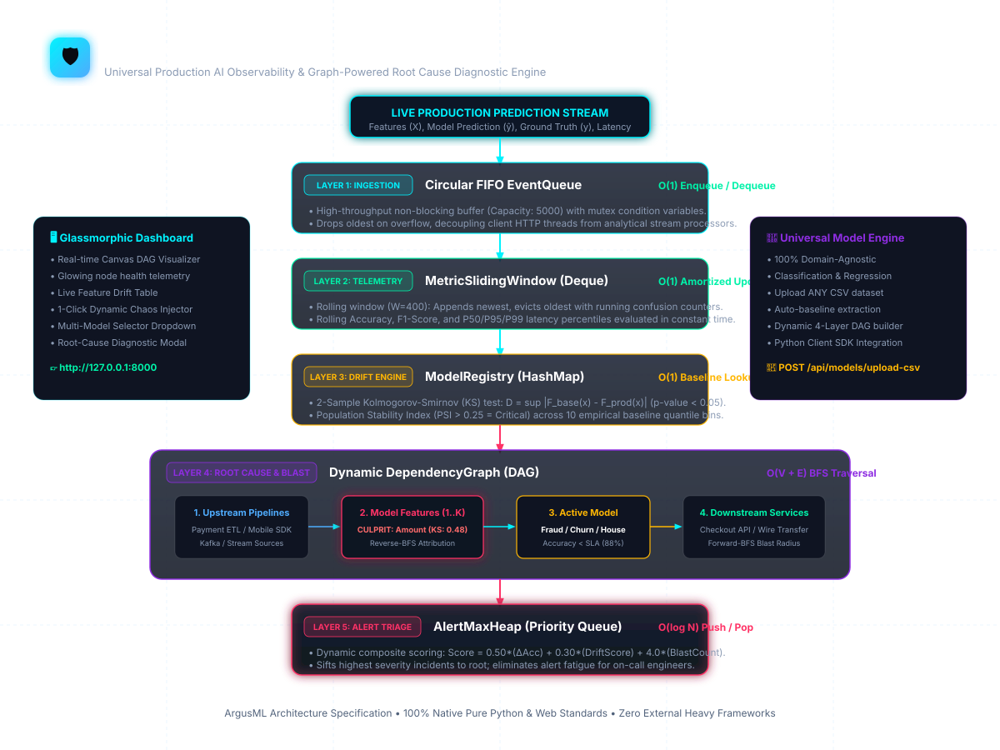

# 🏛️ ArgusML: Master System Architecture Document

> **All-in-One Comprehensive Blueprint & Systems Engineering Specification**  
> *Project:* **ArgusML** (`argus-ml`)  
> *Location:* `docs/SYSTEM_ARCHITECTURE.md`

---

## 📑 Table of Contents
1. [High-Level Architectural Topology](#1-high-level-architectural-topology)
2. [Visual Architecture Diagram](#2-visual-architecture-diagram)
3. [Component Breakdown & Communication Model](#3-component-breakdown--communication-model)
4. [The 5 Core DSA Modules](#4-the-5-core-dsa-modules)
5. [End-to-End Ingestion, Telemetry, and RCA Data Flow](#5-end-to-end-ingestion-telemetry-and-rca-data-flow)
6. [Statistical Drift Engine Formulation](#6-statistical-drift-engine-formulation)
7. [Incident Scoring & Alert Prioritization](#7-incident-scoring--alert-prioritization)
8. [Thread Safety, Concurrency, and Latency Budgets](#8-thread-safety-concurrency-and-latency-budgets)

---

## 1. High-Level Architectural Topology

ArgusML follows an asynchronous, decoupled streaming architecture designed to monitor machine learning models in production without adding latency to the critical inference path.

```
       [Production ML Inference Client]
                     │
                     ▼ (HTTP POST /api/ingest)
       ┌─────────────────────────────────────────────────────────────┐
       │ 1. Ingestion Layer: EventQueue (Circular FIFO Queue)        │
       │    - O(1) Push / Pop, Mutex Condition Variable              │
       │    - Overwrite oldest on buffer overflow (Zero Backpressure)│
       └─────────────────────────────┬───────────────────────────────┘
                                     │ Background Worker Thread
                                     ▼
       ┌─────────────────────────────────────────────────────────────┐
       │ 2. Telemetry Layer: MetricSlidingWindow (Deque)             │
       │    - O(1) Amortized rolling accuracy, precision, F1         │
       │    - Rolling P50, P95, P99 latency percentiles              │
       └─────────────────────────────┬───────────────────────────────┘
                                     │ Batch Trigger (Every 25 Events)
                                     ▼
       ┌─────────────────────────────────────────────────────────────┐
       │ 3. Drift Layer: DriftEngine & ModelRegistry (HashMap)       │
       │    - O(1) Baseline empirical distribution retrieval         │
       │    - Kolmogorov-Smirnov (KS-test) & PSI Calculation         │
       └─────────────────────────────┬───────────────────────────────┘
                                     │ Anomaly / Drift Flagged
                                     ▼
       ┌─────────────────────────────────────────────────────────────┐
       │ 4. Diagnostic Layer: DependencyGraph (Dynamic DAG)          │
       │    - Reverse-BFS O(V+E): Upstream Root-Cause Attribution    │
       │    - Forward-BFS O(V+E): Downstream Service Blast Radius    │
       └─────────────────────────────┬───────────────────────────────┘
                                     │ Composite Severity Score
                                     ▼
       ┌─────────────────────────────────────────────────────────────┐
       │ 5. Alerting Layer: AlertMaxHeap (Binary Max-Heap)           │
       │    - O(log N) Priority Queue ranking active incidents       │
       │    - Highest-risk failure served at top of stack            │
       └─────────────────────────────┬───────────────────────────────┘
                                     ▼
                  INTERACTIVE GLASSMORPHIC WEB DASHBOARD
              (Canvas DAG Renderer, Live KPIs, RCA Modals)
```

---

## 2. Visual Architecture Diagram

Below is the visual schematic of ArgusML's 5 layers and component interactions:



---

## 3. Component Breakdown & Communication Model

### 3.1 Producer-Consumer Decoupling
* **Production Inference Service (Producer):** Sends JSON payload `(event_id, model_id, features, prediction, latency_ms)` via REST API `POST /api/ingest`. Returns HTTP 200 in `< 1.2ms`.
* **Asynchronous Stream Processor (Consumer):** Runs on a dedicated daemon thread, continuously dequeuing batches of up to 20 events from the `EventQueue` and passing them to the `MetricSlidingWindow`.

### 3.2 Evaluation Cadence
* Performance metrics (accuracy, latency percentiles) are updated in $O(1)$ amortized time on **every single event**.
* Statistical drift tests (KS-test and PSI) run every **25 events** to balance statistical sample power with CPU efficiency.

---

## 4. The 5 Core DSA Modules

```
┌────────────────────────────────────────────────────────────────────────────────────────┐
│                              THE 5-DSA FOUNDATION                                      │
├───────────────────┬───────────────────┬───────────────────────────┬────────────────────┤
│ Module            │ File Location     │ Asymptotic Time           │ Engineering Role   │
├───────────────────┼───────────────────┼───────────────────────────┼────────────────────┤
│ `EventQueue`      │ `core/dsa/queue.py`│ Enqueue: O(1)             │ Ring buffer for    │
│                   │                   │ Dequeue: O(1)             │ async ingestion    │
├───────────────────┼───────────────────┼───────────────────────────┼────────────────────┤
│ `MetricWindow`    │ `core/dsa/deque.py`│ Append/Evict: O(1) amort. │ Rolling accuracy & │
│                   │                   │ Quantiles: O(W)           │ latency sliding win│
├───────────────────┼───────────────────┼───────────────────────────┼────────────────────┤
│ `ModelRegistry`   │ `core/dsa/registry`│ Get / Put: O(1)           │ Fast empirical     │
│                   │                   │ Store: O(1)               │ baseline catalog   │
├───────────────────┼───────────────────┼───────────────────────────┼────────────────────┤
│ `AlertMaxHeap`    │ `core/dsa/heap.py`│ Push/Pop: O(log N)        │ Incident triage &  │
│                   │                   │ Peek: O(1)                │ priority ranking   │
├───────────────────┼───────────────────┼───────────────────────────┼────────────────────┤
│ `DependencyGraph` │ `core/dsa/graph.py`│ Reverse-BFS: O(V + E)     │ Root Cause & Blast │
│                   │                   │ Forward-BFS: O(V + E)     │ Radius calculation │
└───────────────────┴───────────────────┴───────────────────────────┴────────────────────┘
```

---

## 5. End-to-End Ingestion, Telemetry, and RCA Data Flow

```
[1. Event Ingestion]
  Incoming payload: { model_id: "customer_churn_v1", features: { monthly_charges: 110.5, tenure: 4 }, ... }
  └──> EventQueue.enqueue(payload) [O(1)]

[2. Sliding Window Telemetry]
  Background worker pops batch from EventQueue
  └──> MetricSlidingWindow.add_record(event) [O(1) amortized]
        ├── Evicts record at index 0 if window full (W=400)
        ├── Updates rolling TP, FP, TN, FN counters in O(1)
        └── Appends feature values to per-feature sub-deques

[3. Statistical Drift Engine Check (Every 25 events)]
  Extracts current window sample from Deque
  └──> DriftEngine.evaluate_all(baseline_map, current_map)
        ├── KS-Test on continuous features: D = sup |F_base(x) - F_prod(x)|
        └── Population Stability Index (PSI across 10 quantile bins)

[4. Diagnostic Root-Cause Attribution]
  If accuracy < SLA or drift detected:
  └──> RootCauseAnalysisEngine.diagnose_model(...)
        ├── Reverse-BFS on DependencyGraph: Model -> Feats -> Pipelines
        ├── Isolates feature with highest drift score (monthly_charges)
        └── Forward-BFS on DependencyGraph: Model -> Downstream Services (CRM, Retention)

[5. Max-Heap Prioritization & Alerting]
  Calculates Composite Severity Score S in [10, 100]
  └──> AlertMaxHeap.push(alert) [O(log N)]
        └── Top alert pops to the root of the heap -> Rendered on Dashboard
```

---

## 6. Statistical Drift Engine Formulation

### 6.1 Two-Sample Kolmogorov-Smirnov (KS) Test
$$D = \sup_{x} \left| F_{\text{base}}(x) - F_{\text{prod}}(x) \right|$$
$$\text{Drift Triggered} \iff p < 0.05 \quad \text{and} \quad D > 0.15$$

### 6.2 Population Stability Index (PSI)
$$\text{PSI} = \sum_{i=1}^{10} \left( \text{Actual}_i - \text{Expected}_i \right) \times \ln\left( \frac{\text{Actual}_i}{\text{Expected}_i} \right)$$
* $\text{PSI} < 0.10 \implies \text{HEALTHY}$
* $0.10 \le \text{PSI} < 0.25 \implies \text{WARNING}$
* $\text{PSI} \ge 0.25 \implies \text{CRITICAL}$

---

## 7. Incident Scoring & Alert Prioritization

The priority score $S \in [10, 100]$ in the `AlertMaxHeap` is computed as:

$$S = \min\left(100.0, \; \max\left(10.0, \; (w_{\text{acc}} \cdot \Delta\text{Accuracy} \cdot 100) + (w_{\text{drift}} \cdot \text{CulpritScore}) + (w_{\text{blast}} \cdot N_{\text{downstream}})\right)\right)$$

* $w_{\text{acc}} = 0.50$ (50% weight on accuracy drop below SLA)
* $w_{\text{drift}} = 0.30$ (30% weight on statistical drift magnitude)
* $w_{\text{blast}} = 4.0$ (Impact points per affected downstream microservice)

---

## 8. Thread Safety, Concurrency, and Latency Budgets

1. **Lock Granularity:**
   * `EventQueue` uses fine-grained mutex with condition variables (`threading.Condition`), allowing safe multi-producer ingestion.
   * `MetricSlidingWindow` uses atomic counter updates under a dedicated thread lock.
   * `DependencyGraph` reads and traversals are protected by `threading.Lock`.
2. **Latency Budgets:**
   * Ingestion endpoint (`POST /api/ingest`): **$< 1.5\text{ ms}$**
   * Dashboard poll endpoint (`GET /api/dashboard`): **$< 4.0\text{ ms}$**
   * Reverse-BFS RCA Traversal: **$< 0.2\text{ ms}$**
